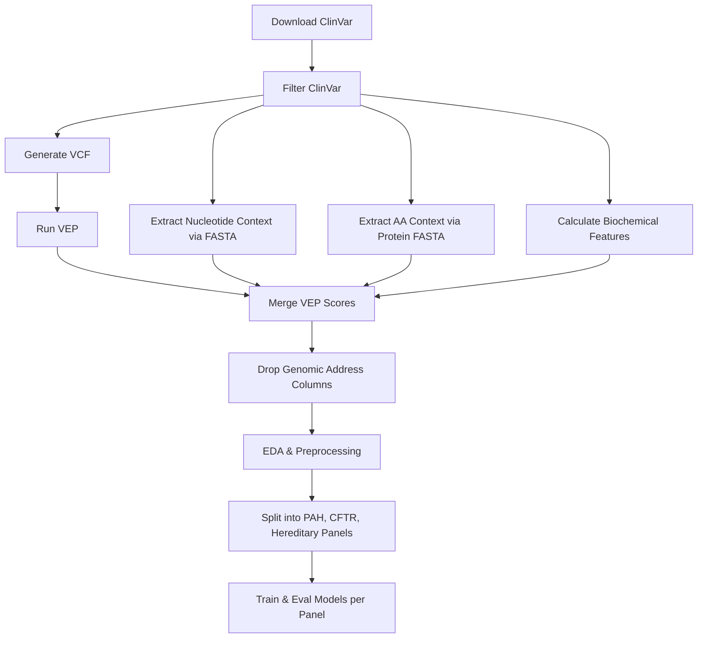

# Missense Variant Classification — Project Plan

**TEKNOFEST 2026 — Sağlıkta Yapay Zeka (Üniversite Seviyesi)**

---

## 1. Project Overview

Build a machine-learning pipeline (delivered as a Jupyter notebook — `.ipynb`) that classifies missense single-nucleotide variants (SNVs) as **Pathogenic** or **Benign** for three hereditary-disease gene groups: **PAH**, **CFTR**, and a hereditary cancer gene panel (see §2.1).

---

## 2. Data Sources & Acquisition

### 2.1 ClinVar — Variant Labels & Metadata

| Item | Detail |
|---|---|
| **Source** | [ClinVar clinvar_20260218.vcf.gz](https://ftp.ncbi.nlm.nih.gov/pub/clinvar/vcf_GRCh38/) |
| **Format** | VCF |
| **Why** | Provides variant IDs, gene symbols, clinical significance labels, review status (star count), variant type, chromosome, position |
| **Download** | `wget` or Python `urllib` inside the notebook |

**Filtering applied on ClinVar (Adjustment §3.1–3.5):**

1. Keep only rows where `ReviewStatus` is exactly one of:
   - `reviewed by expert panel`
   - `practice guideline`
2. Keep only **Type = "single nucleotide variant"** and **Molecular Consequence = missense**.
3. Keep only genes: `PAH`, `CFTR`, and the hereditary cancer panel genes (list below).
4. Reclassify labels:
   - `Benign` + `Likely benign` → **Benign**
   - `Pathogenic` + `Likely pathogenic` → **Pathogenic**
   - Remove **VUS** and any other significance class.
5. Retain `Chromosome` and `PositionVCF` (GRCh38) columns **only for merging**; drop them from the final feature matrix.

**Hereditary cancer gene panel (include all of these):**

- Breast and ovarian cancer genes: `BRCA1`, `BRCA2`, `PALB2`
- Digestive system and Lynch syndrome genes: `MLH1`, `MSH2`, `MSH6`, `PMS2`, `EPCAM`
- Other key risk genes: `TP53`, `APC`, `PTEN`, `CDH1`

---

### 2.2 Ensembl VEP — In Silico Risk Scores & Annotation

| Item | Detail |
|---|---|
| **Source** | **Offline VEP** with cache + plugins |
| **Format** | VCF/TSV |
| **Why** | Single entry point to obtain SIFT, PolyPhen-2, CADD, REVEL, MetaLR, GERP++, phyloP, phastCons, and more |

**How it will be used:**

1. Construct a VCF from the ClinVar-filtered variants (`CHROM`, `POS`, `REF`, `ALT`).
2. **Offline VEP** (recommended for reproducibility): Install VEP + GRCh38 cache + dbNSFP plugin locally and run:
   ```bash
   vep -i input.vcf --cache --assembly GRCh38 \
       --plugin dbNSFP,dbNSFP4.5a.gz,SIFT_score,Polyphen2_HDIV_score,\
       CADD_phred,REVEL_score,MetaLR_score,GERP++_RS,\
       phyloP100way_vertebrate,phastCons100way_vertebrate \
       --af_gnomad \
       --tab -o vep_output.tsv
   ```
3. Parse output; merge back to ClinVar data on **chrom + pos + ref + alt**.

**Scores extracted from VEP / dbNSFP:**

| Score | Category |
|---|---|
| SIFT score | In silico risk |
| PolyPhen-2 (HDIV & HVAR) | In silico risk |
| CADD phred | In silico risk |
| REVEL | In silico risk |
| MetaLR | In silico risk |
| GERP++ RS | Evolutionary conservation |
| phyloP (100-way vertebrate) | Evolutionary conservation |
| phastCons (100-way vertebrate) | Evolutionary conservation |

---

### 2.3 Reference FASTA — Nucleotide Sequence Context

| Item | Detail |
|---|---|
| **Source** | [GRCh38 primary assembly FASTA](https://ftp.ensembl.org/pub/release-112/fasta/homo_sapiens/dna/Homo_sapiens.GRCh38.dna.primary_assembly.fa.gz) |
| **Format** | FASTA (indexed with `samtools faidx`) |
| **Why** | Extract ±k flanking nucleotides around each variant position to capture local sequence context |

**How it will be used:**

1. Index the FASTA with `pysam` (Python wrapper for `htslib`).
2. For each variant, extract a **window of ±5 nt** around the position.
3. Encode the flanking sequence as features:
   - One-hot encoding of each flanking nucleotide.
   - k-mer frequency counts (e.g., tri-nucleotide context).
   - GC content within the window.
4. The reference & alternate allele at position 0 are stored separately as **Sequence & Change Info** features.

---

### 2.4 UniProt / Ensembl Protein FASTA — Amino Acid Sequence Context

| Item | Detail |
|---|---|
| **Source** | Local FASTA file: `idmapping_2026_03_16.fasta` (UniProt canonical sequences) |
| **Why** | Extract ±k flanking amino acids around the missense change position |

**How it will be used:**

1. Use the local file `idmapping_2026_03_16.fasta`, which already includes PAH, CFTR, and the hereditary cancer panel genes.
2. Map ClinVar protein change notation (e.g., `p.Arg408Trp`) to position in the protein.
3. Extract **±5 amino acids** flanking the substitution site.
4. Encode:
   - One-hot encode each flanking amino acid (20 standard + gap).
   - Local amino acid composition features (hydrophobic %, charged %, etc.).

---

### 2.5 gnomAD — Population Allele Frequencies (MAF)

| Item | Detail |
|---|---|
| **Source** | **VEP `--af_gnomad` (preferred for ~1500 variants)** or gnomAD v4 API |
| **Format** | VEP TSV or GraphQL API (JSON) |
| **Why** | Minor Allele Frequency (MAF) is a key population-level feature |

**How it will be used:**

1. Prefer VEP with `--af_gnomad` to obtain Global MAF directly in the VEP output.
2. Extract:
   - **Global MAF** (`AF`)
3. Missing variants are assigned `MAF = 0` (ultra-rare / absent).
4. Merge on **chrom + pos**.

> **Alternative:** Use the gnomAD API only if VEP `--af_gnomad` is unavailable.

---

## 3. Feature Engineering

### 3.1 Biochemical & Structural Effect Features

Computed **from the amino acid substitution** (ref AA → alt AA) using lookup tables in the notebook:

| Feature | Computation |
|---|---|
| **ΔHydrophobicity** | Kyte-Doolittle scale: `H(alt) − H(ref)` |
| **ΔVolume** | Amino acid side-chain volume: `V(alt) − V(ref)` |
| **ΔCharge** | Charge at pH 7: `Q(alt) − Q(ref)` |
| **ΔMolecular Weight** | `MW(alt) − MW(ref)` |
| **ΔPolarity** | Grantham polarity: `P(alt) − P(ref)` |
| **Grantham Distance** | Pre-computed 20×20 matrix ([Grantham 1974](https://doi.org/10.1126/science.185.4154.862)) |

> All lookup dictionaries will be defined in a dedicated notebook cell for transparency.

### 3.2 Sequence & Change Info

| Feature | Source |
|---|---|
| REF nucleotide | ClinVar / VCF |
| ALT nucleotide | ClinVar / VCF |
| REF amino acid | ClinVar protein change |
| ALT amino acid | ClinVar protein change |
| Codon position (1st / 2nd / 3rd) | Derived from CDS mapping |
| Transition vs. Transversion | Derived from REF/ALT nucleotide |

### 3.3 Local Sequence Context — Nucleotide (from FASTA §2.3)

- Flanking ±5 nt one-hot features (or k-mer frequency)
- Tri-nucleotide context (e.g., `ACG → ATG`)
- Local GC content

### 3.4 Local Sequence Context — Amino Acid (from Protein FASTA §2.4)

- Flanking ±5 AA one-hot features
- Local hydrophobicity profile
- Local secondary-structure propensity (optional, from amino acid identity)

### 3.5 Evolutionary Conservation (from VEP §2.2)

- phyloP 100-way vertebrate score
- phastCons 100-way vertebrate score
- GERP++ RS score

### 3.6 Population Data / MAF (from gnomAD §2.5)

- Global allele frequency

### 3.7 In Silico Risk Scores (from VEP §2.2)

- SIFT score
- PolyPhen-2 HDIV/HVAR score
- CADD phred score
- REVEL score
- MetaLR score

---

## 4. Data Merging Strategy

```
ClinVar (filtered)
    │
    ├── merge on [CHROM + POS + REF + ALT] ──► VEP output (in silico + conservation)
    │
    ├── merge on [CHROM + POS] ──────────────► gnomAD MAF (if separate)
    │
    ├── merge on [CHROM + POS] ──────────────► Nucleotide context (from FASTA)
    │
    └── merge on [Gene + Protein Position] ──► Amino acid context (from Protein FASTA)
```

**After all merges → drop `Chromosome`, `Position`, `Start`, `Stop` and any other genomic-address columns.** These are used exclusively as join keys.

---

## 5. Notebook Structure (Cell Layout)

| # | Cell | Purpose |
|---|---|---|
| 1 | **Imports & Config** | Libraries, `TARGET_GENES`, paths, random seed |
| 2 | **ClinVar Download & Load** | Download `variant_summary.txt.gz`, read into DataFrame |
| 3 | **ClinVar Filtering** | Apply adjustments §3.1–3.5 (review stars, SNV, missense, genes, labels) |
| 4 | **Generate Input VCF** | Create minimal VCF for VEP from filtered variants |
| 5 | **Run / Load VEP Results** | Run offline VEP and load output |
| 6 | **gnomAD MAF Retrieval** | Extract Global MAF from VEP `--af_gnomad` output |
| 7 | **Nucleotide Context Extraction** | `pysam` + GRCh38 FASTA → flanking nt features |
| 8 | **Protein Context Extraction** | UniProt FASTA → flanking AA features |
| 9 | **Biochemical Feature Calculation** | ΔHydrophobicity, ΔVolume, ΔCharge, ΔMW, ΔPolarity, Grantham |
| 10 | **Merge All Features** | Join on chrom+pos keys then **drop** genomic address columns |
| 11 | **EDA & Visualization** | Class balance, feature distributions, correlation heatmap |
| 12 | **Preprocessing** | Handle missing values, encode categoricals, scale numerics, split dataset into 3 panels (PAH, CFTR, Hereditary), then train/test split per panel |
| 13 | **Model Training** | Train candidate models for each panel (e.g., XGBoost, LightGBM, Random Forest) |
| 14 | **Hyperparameter Tuning** | GridSearchCV / Optuna per panel |
| 15 | **Evaluation** | Accuracy, F1, ROC-AUC, Precision-Recall, Confusion Matrix per panel |
| 16 | **Feature Importance** | SHAP values / built-in importance per panel |
| 17 | **Conclusion & Export** | Save model artifacts, summarize results for all panels |

---

## 6. Key Libraries

| Library | Purpose |
|---|---|
| `pandas`, `numpy` | Data wrangling |
| `pysam` | FASTA reading for nucleotide context |
| `biopython` | Protein FASTA parsing, sequence manipulation |
| `requests` | VEP REST API & gnomAD API calls |
| `scikit-learn` | Preprocessing, model training, evaluation |
| `xgboost` / `lightgbm` | Gradient boosted tree classifiers |
| `matplotlib`, `seaborn` | Visualization |
| `shap` | Feature importance explanation |
| `optuna` | Hyperparameter optimization (optional) |

---

## 7. File / Folder Structure (Expected)

```
missense_classification/
├── _prompt.txt
├── PROJECT_PLAN.md              ← this file
├── missense_classification.ipynb ← main analysis notebook
├── data/
│   ├── raw/
│   │   ├── variant_summary.txt.gz      (ClinVar)
│   │   ├── GRCh38.primary_assembly.fa  (Reference FASTA)
│   │   ├── GRCh38.primary_assembly.fa.fai
│   │   └── protein_sequences/
│   │       ├── PAH.fasta
│   │       ├── CFTR.fasta
│   │       └── <HEREDITARY_GENE>.fasta
│   ├── processed/
│   │   ├── clinvar_filtered.csv
│   │   ├── vep_results.tsv
│   │   └── features_merged.csv
├── models/
│   └── best_model.pkl
└── .venv/
```

---

## 8. Execution Order & Dependencies



---

## 9. Risks & Mitigations

| Risk | Mitigation |
|---|---|
| Small dataset after strict filtering (expert panel / practice guideline, targeted genes) | Track class counts after filtering; consider stratified CV; allow fallback to 2-star only if approved |
| VEP offline setup and dbNSFP availability | Confirm cache + dbNSFP paths early; run a small test VCF before full run |
| Missing gnomAD AF for some variants | Impute Global MAF = 0 and add a missing-flag feature |
| Protein position mapping errors (long proteins) | Spot-check protein position parsing; flag unmapped variants |

---

## 10. Summary — Data Source → Feature Mapping

| Requirement | Data Source | File / API |
|---|---|---|
| Biochemical & Structural Effects | Amino acid lookup tables (hardcoded) | Notebook cell |
| Sequence & Change Info | ClinVar + VCF construction | `variant_summary.txt.gz` |
| Local Nucleotide Context | Reference genome FASTA | `GRCh38.primary_assembly.fa` |
| Local Amino Acid Context | UniProt protein FASTA | `PAH.fasta`, `CFTR.fasta`, panel gene FASTAs |
| Evolutionary Conservation | VEP + dbNSFP plugin | VEP REST API or offline cache |
| Population Data / MAF | gnomAD (via VEP flag) | VEP `--af_gnomad` |
| In Silico Risk Scores | VEP + dbNSFP plugin | VEP REST API or offline cache |
